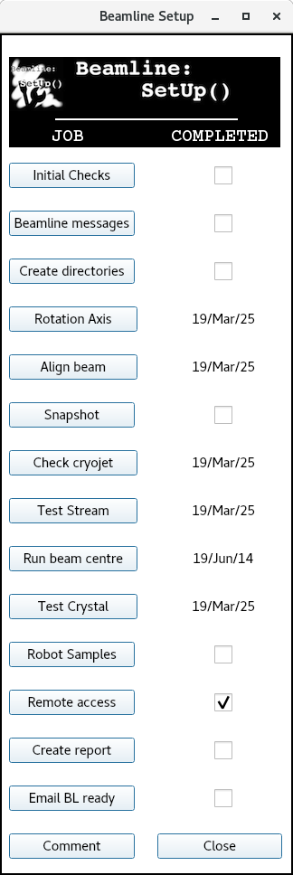
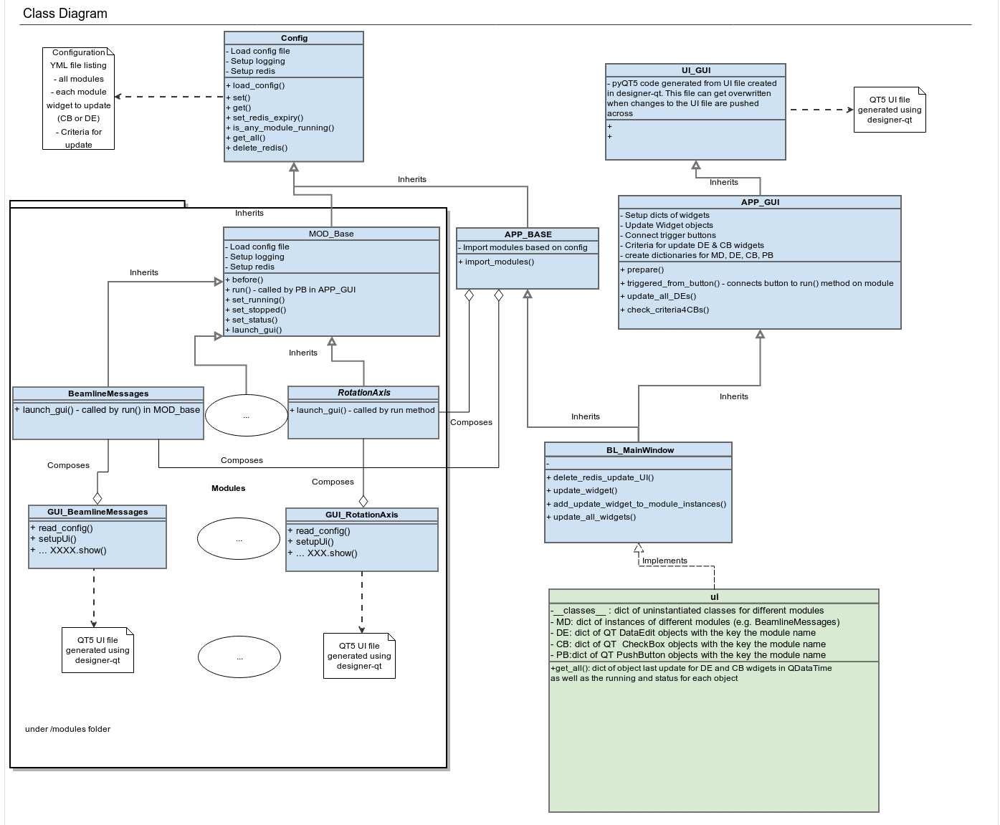

# Yet Another Beamline Setup for MX beamlines

## Objectives

### Intro

Setting up a synchrotron X-ray beamline (BL) requires a series of QC tasks to be done. 
This app is a combination of a QT5 GUI plus a series of modules that will help a 
staff member follow the steps required to delivery a beamline to users.

### What there an effort to make it portable ?

The GUI is written in QT5 using QT designer to generate UI files and later convert
them to python (v3.7). This should make it fairly easy to port and modify the GUI.
On another hand some abstraction layer is in place so that changing the config 
file as well as modifiying the modules defined under modules/ one can change the
underlying behaviour. 

### What automation does it aim?

Although it is possible to automate most of the tasks in terms of running beamline
equipment to perform and drive things (e.g. calculate centroid of beam and move
beam to chrosshairs or vice versa) this is not the main aim for this application
as each synchrotron and beamline will have their own hardware/software implementations. 
Instead the main objective of this application is to provide :
- Run a systematic list of tasks before delivering a BL to users
- Be a guide to a new staff member on what is required to deliver a BL to users
- Collect data (number, pictures, etc) for each task so that some kind of FOM can be obtained
- Log what tasks are done each day allowing awareness of how long is not run
- Provide a QC report that could be given to users for each experiment

## Historic perspective 

This is a re-write in QT5 of a system that was very successfully run at the
Australian Synchrotron two MX beamlines from 2013 to 2019. The original was based
in WXPython and Python v2.7 so there was a need to update the technologies. The
original was written by [Nathan Cowieson][1] (now at DLS) and modified by [David Aragao][2]
(also now at DLS) and others from 2015 to 2019. Original wxPython code resides in [github][3]

[1]: https://scholar.google.co.uk/citations?user=Pm8cz6MAAAAJ&hl=en
[2]: https://scholar.google.com/citations?user=Q6Dn-XUAAAAJ&hl=en]
[3]: https://github.com/AustralianSynchrotron/BeamlineSetup

## Code organization (work in progress, will evolve as required)

